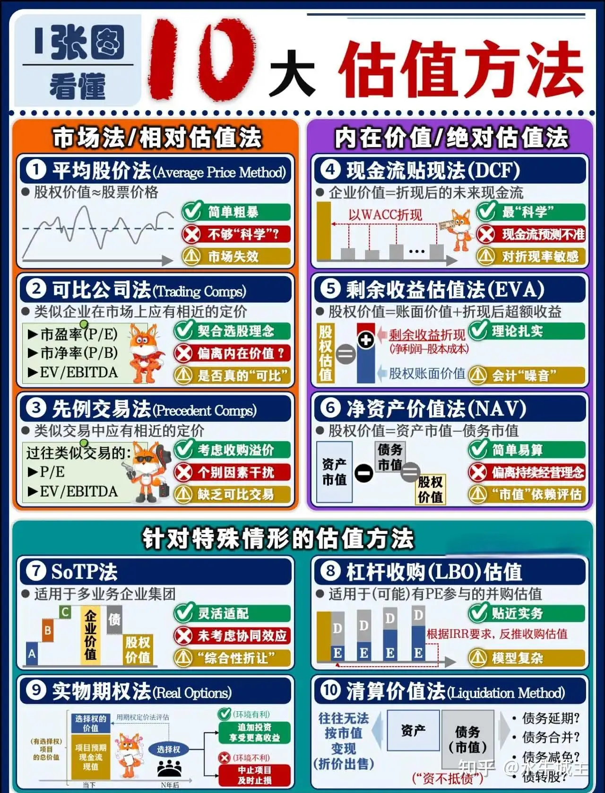

# 现金流折现

现金流折现模型（Discounted Cashflow Model，DCF模型）是一种基于未来现金流预测的资产估值方法，主要用于评估企业、资产或项目的内在价值。其核心原理是将预期产生的自由现金流按折现率折算为现值总和，以此作为估值依据。

局限：现金流折现模型更适合的环境是项目投资决策、企业并购定价、固定收益类资产定价等。如果涉及股市，现金流折现模型适用于盈利稳定、现金流可预测的成熟企业，而对于初创型公司（现金流往往为负）、周期性企业（盈利波动剧烈）、科技类企业（一些其他指标更能决定企业生死）等，该模型的实际运用效果往往受到极大限制。

# 靳卫萍老师的课

